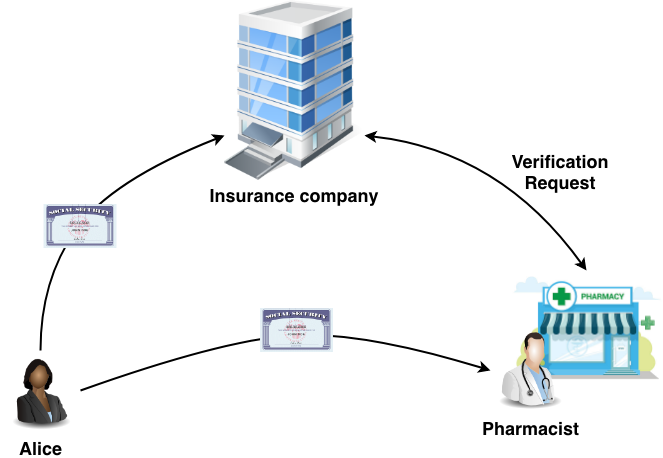
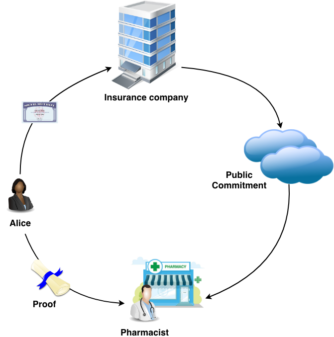

# RSA Accumulator


I present a simple example with a prover and a verifier who **do not know** each other in advance and only share data in the form of a commitment to a set.

The source code to the cryptographic accumulator is an evolution of a product from [starcoin](http://starcoin.org/) which has an accumulator implementation which needs the original value in addition to the proof in order to prove membership of a set.

This updated implementation **only needs a hash** of the original value **alongside the proof**.

The MIT licensed source can be found here: https://github.com/cyborch/rsa-accumulator

## A quick introduction to accumulators

A cryptographic accumulator is akin to a hash function in that it takes a message - in this case a set - as input and outputs a constant sized value which - unlike hashes - can be used to verify one of the values in the set.

Previous implementations of cryptographic accumulators have required that the original value is sent to the verifier along with the proof, whereas this implementation merely needs a hash which is sent alongside the proof.

To illustrate the usefulness of this technology let's look at a simplified use-case:

Let’s assume, for a moment, that we have an insurance company **"Crypto-Cross of California"** which has a list of subscribers. **Alice** signs up for insurance and gets a **proof** of insurance.

**In the past**, when Alice went to the pharmacy to pick up her medicine, the pharmacist would ask for her social security number and look her up in the system. **The lookup was an interactive process**, where the pharmacy would authenticate against the insurance company systems before getting verification of insurance, and would involve **leaking the SSN** to the clerk at the pharmacy who could potentially write it down and use it to steal Alice’s identity later.



**Crypto-Cross of California**, on the other hand, makes a **public commitment** to the list of current subscribers. With this system, Alice will go to the pharmacy and only show her proof of insurance to the pharmacist. The pharmacist **does not need to authenticate** before reading the commitment, because there is no inherent data leak in the commitment. Hence, the verification can now be non-interactive. All the pharmacist sees is a **proof and a hash of the SSN**. Given that, it is now possible to prove that **Alice** is in the list of subscribers just from reading the commitment without risk of identity theft from the clerk at the pharmacy.



## The setup

Keeping with the use-case above, **Crypto-Cross of California** needs a signup page which includes the ability to sign up and add your SSN to their list of subscribers. It also needs a **publicly available commitment**. For our demonstration purposes a small [Javalin](https://javalin.io/) application will serve as the backend for our signup and commitment services.

```
fun main() {
    val acc = RSAAccumulator()
    val app = Javalin.create().start(7000)
    app.get("/commitment") { ctx ->
        ctx.result(acc.commitment.toString(10))
    }
    app.put("/add/:member") { ctx ->
        val member = ctx.pathParam("member")
        acc.add(member)
        ctx.json(ProofResponse(acc.proveMembership(member)))
    }
}
```

In a real world scenario, we would probably guard the `/add/:member` endpoint with all kinds of restrictions before adding the input to the set, but for our demonstration purposes, this will do.

Notice that the **accumulator carries the state** which includes the full set of all members in the set and the commitment which is generated from a random big integer and updated with a hash of a new member whenever a member is added to the set.

The **commitment** might be served directly from the pharmacy servers, or **might be copied to any public location**.

At this point, the pharmacy - **or anyone** - can set up a verifier for a commitment. It might be just as simple.

```
fun main() {
    val app = Javalin.create().start(7000)
    app.post("/verify") { ctx ->
        val body = ctx.bodyAsClass(VerifyBody::class.java)
        ctx.json(RSAAccumulator
            .verifyMembership(
                BigInteger(body.commitment),
                body.proof
            )
        )
    }
}
```

Notice that the verifier uses a **stateless accumulator** to verify the proof against the commitment, and the **original value is never transferred** to the verifier.

## The guts

By now, it’s time to **deep dive** into the actual implementation of the accumulator to find out what is really going on. To start with, adding a member to the set involves generating a hash which, with the addition of a salt, is a prime and updating the commitment to be the exponent of the hash and applying modulus of [RSA-2048](https://en.wikipedia.org/wiki/RSA_numbers#RSA-2048):

```
fun add(x: BigInteger): RSACommit {
    return if (data.containsKey(x)) {
        commitment
    } else {
        val (hashPrime, nonce) = hashToPrime(
            x,
            ACCUMULATED_PRIME_SIZE
        )
        commitment = commitment.modPow(hashPrime, n)
        data[x] = nonce
        commitment
    }
}

fun hashToPrime(x: BigInteger, bitLength: Int = 120, initNonce: BigInteger = BigInteger.ZERO): TwoValue<BigInteger> {
    var nonce = initNonce
    while (true) {
        val num = hashToLength(x + nonce, bitLength)
        if (num.isProbablePrime(primeCertainty)) {
            return TwoValue(num, nonce)
        }
        nonce += BigInteger.ONE
    }
}

fun hashToLength(x: BigInteger, bitLength: Int): BigInteger {
    var hexString = ""
    val numOfBlocks = Math.ceil(bitLength / 256.00).toInt()
    for (i in 0 until numOfBlocks) {
        hexString += sha256.hashBytes(
            (x + i.toBigInteger())
                .toString(10)
                .toByteArray()
        ).asBytes()
            .toHexString()
    }

    if (bitLength % 256 > 0) {
        // # we do assume divisible by 4
        hexString =
            hexString.substring((bitLength % 256) / 4)
    }
    return BigInteger(hexString, 16)
}
```

Once added, a proof can be generated by multiplying all the other prime hashes which were generated for the set and applying the same modulus, which is ultimately returned along with the prime, salted hash for the given value (using the same `hashToPrime` and `hashToLength` utility functions as above):

```
fun proveMembershipOrNull(x: BigInteger): RSAProof? {
    return if (!data.containsKey(x)) {
        null
    } else {
        var product = BigInteger.ONE
        for ((k, v) in data) {
            if (k != x) {
                product *= hashToPrime(
                    k, 
                    ACCUMULATED_PRIME_SIZE, 
                    v
                ).first
            }
        }
        RSAProof(
            A0.modPow(product, n),
            hashToPrime(
                x, 
                ACCUMULATED_PRIME_SIZE, 
                getNonce(x)
            ).first
        )
    }
}
```

## The beautifully simple verification

Finally - and this is really the beauty of this implementation - proving that a value is in the set simply involves taking the **proof** and finding the value of its salted hash (**x**) exponent modulus RSA-2048 (**n**) and comparing that to the commitment (**A**):

```
fun verifyMembership(A: BigInteger, x: BigInteger, proof: BigInteger): Boolean {
    return proof.modPow(x, n) == A
}
```

We now have a complete process where a prover can generate a proof for a set membership and anyone can verify the proof, using the commitment and the salted hash of the value.

## Final thoughts

Given this technology, we now have the ability to anonymously prove memberships of sets in almost any imaginable context. There are obvious use-cases in decentralised authentication, but there may be many more interesting uses for it.

_In real world scenarios, hash salting may come into play, especially if the set of possible values is as small as in the case of SSNs. The example given above is just that - an illustrative example - and should not be taken as a real world use-case._